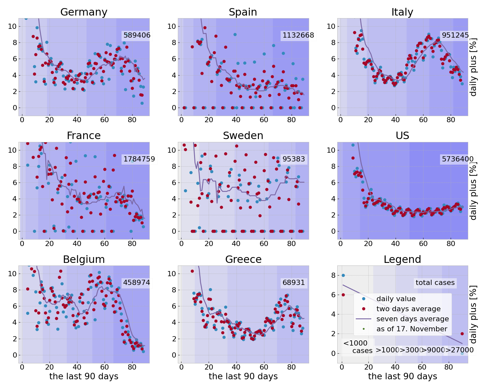
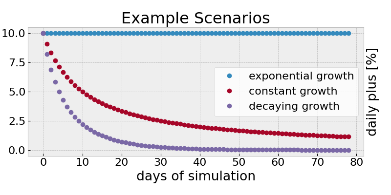
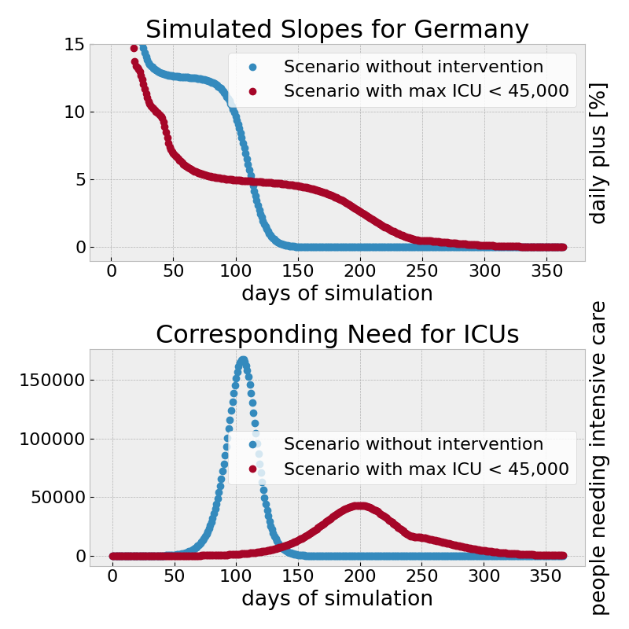

# Analysis of the growth in Casualties 

This script uses the data of the John Hopkins university to examine the growth
in the casualties due to COVID-19 in a number of countries.

Use 

```
git clone --recursive
```

to have the data cloned together with the repo and then run

```
python3 deathgrowthrates.py
```

to produced the plots.




